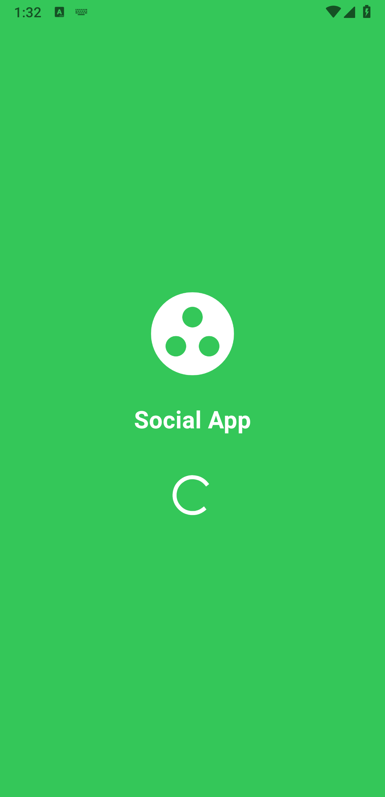
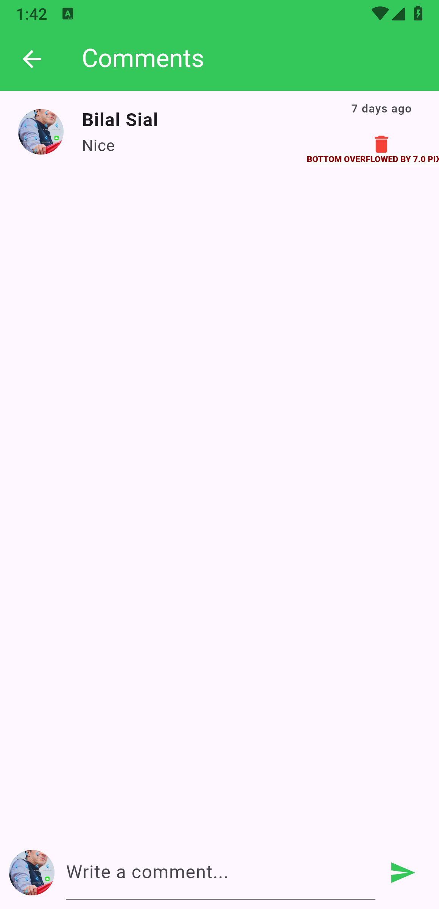

 
# 📱 Flutter Social Media App  

A **modern Flutter-based social media application** that allows users to connect, share, and interact in real-time.  
Built with **Flutter** and **Dart**, this project demonstrates the complete workflow of a social networking app — from authentication to posting, liking, and chatting.  

---


## ✨ App Screenshots  

<p align="center">
  
  
  
  
  
  
  
  
  
  
  
  
  
  
  
  
  
  
  
  
</p>  


---

## 🚀 Features  

- 🔐 **Authentication System** – User signup, login, and profile management  
- 📝 **Create & Share Posts** – Upload text, images, and multimedia posts  
- ❤️ **Engagement Features** – Like, comment, and share posts  
- 💬 **Real-Time Chat** – One-to-one instant messaging  
- 👤 **User Profiles** – Personalized profile with bio, picture, and posts  
- 📱 **Responsive UI** – Clean, modern, and mobile-friendly design  

---

## 🛠️ Technology Stack  

- **Framework:** [Flutter](https://flutter.dev/)  
- **Language:** [Dart](https://dart.dev/)  
- **Backend & Database:** Firebase / REST API (if connected)  
- **Packages Used:**  
  - `provider` – State management  
  - `firebase_auth` – Authentication  
  - `cloud_firestore` – Database  
  - `firebase_storage` – Media storage  
  - `image_picker` – Upload images  
  - `http` – API requests  

---

## ⚡ Getting Started  

### Prerequisites  
- Install **Flutter SDK** → [Install Guide](https://docs.flutter.dev/get-started/install)  
- Editor → VS Code / Android Studio  
- Firebase Project (if backend enabled)  

### Installation  

1. Clone this repo  

   git clone https://github.com/NoorMustafa4556/Social-Media-App-Flutter.git
   cd Social-Media-App-Flutter


2. Install dependencies

   ```bash
   flutter pub get
   ```

3. Setup Firebase (if required)

   * Add your `google-services.json` (Android)
   * Add your `GoogleService-Info.plist` (iOS)

4. Run the app

   ```bash
   flutter run
   ```

---

## 📂 Project Structure

```
lib/
 ├── models/        # Data models (User, Post, Message)
 ├── providers/     # State management with Provider
 ├── screens/       # App UI screens
 ├── widgets/       # Reusable widgets
 ├── services/      # Firebase/API integration
 └── main.dart      # Entry point
```

---

## 🤝 Contributing

Contributions are welcome! 🎉

1. Fork the repo
2. Create a new branch (`feature/YourFeature`)
3. Commit your changes
4. Push to your fork
5. Open a Pull Request

---

#  👋🏻 Hi, I'm Noor Mustafa

A passionate and results-driven **Flutter Developer** from **Bahawalpur, Pakistan**, specializing in building elegant, scalable, and high-performance cross-platform mobile applications using **Flutter** and **Dart**.

With a strong understanding of **UI/UX principles**, **state management**, and **API integration**, I aim to deliver apps that are not only functional but also user-centric and visually compelling. My development approach emphasizes clean code, reusability, and performance.

---

## 🚀 What I Do

- 🧑‍💻 **Flutter App Development** – I build cross-platform apps for Android, iOS, and the web using Flutter.
- 🔗 **API Integration** – I connect apps to powerful RESTful APIs and third-party services.
- 🎨 **UI/UX Design** – I craft responsive and animated interfaces that elevate the user experience.
- 🔐 **Authentication & Firebase** – I implement secure login systems and integrate Firebase services.
- ⚙️ **State Management** – I use Provider, setState, and Riverpod (in-progress) for scalable app architecture.
- 🧠 **Clean Architecture** – I follow MVVM and MVC patterns for maintainable code.

---


## 🌟 Projects I'm Proud Of

- 🌤️ **[Live Weather Check App](https://github.com/NoorMustafa4556/Live-Weather-Check-App)** – Real-time weather forecast using OpenWeatherMap API  
- 🤖 **[AI Chatbot (Gemini)](https://github.com/NoorMustafa4556/Ai-ChatBot)** – Conversational AI chatbot powered by Google’s Gemini  

- 🍔 **[Recipe App](https://github.com/NoorMustafa4556/Recipe-App)** – Discover recipes with images, categories, and step-by-step instructions  

- 📚 **[Palindrome Checker](https://github.com/NoorMustafa4556/Palindrome-Checker-App)** – A Theory of Automata-based project to identify palindromic strings  

> 🎯 Check out all my repositories on [github.com/NoorMustafa4556](https://github.com/NoorMustafa4556?tab=repositories)


---

## 🛠️ Tech Stack & Tools

| Area                | Tools/Technologies |
|---------------------|--------------------|
| **Languages**       | Dart, JavaScript, Python (basic) |
| **Mobile Framework**| Flutter            |
| **Backend/Cloud**   | Firebase (Auth, Realtime DB, Storage), Django, Flask |
| **Frontend (Web)**  | React.js (basic), HTML, CSS, Bootstrap |
| **State Management**| Provider, setState, Riverpod (learning) |
| **API & Storage**   | REST APIs, HTTP, Shared Preferences, SQLite |
| **Design**          | Material, Cupertino, Lottie Animations, Gradient UI |
| **Version Control** | Git, GitHub        |
| **Tools**           | Android Studio, VS Code, Postman, Figma (basic) |

---

## 🧰 Tech Toolbox

<p align="left">
  
  
  
  
  
  
  
  
</p>

---

## 📈 Current Focus

- 💡 Enhancing Flutter animations and transitions
- 🤖 Implementing AI-based logic with Google Gemini API
- 📲 Building portfolio-level applications using full-stack Django & Flutter

---

## 📫 Let's Connect!

<p align="left">
  <a href="https://x.com/NoorMustafa4556" target="blank">
    
  </a>
  <a href="https://www.linkedin.com/in/noormustafa4556/" target="blank">
    
  </a>
  <a href="https://www.facebook.com/NoorMustafa4556" target="blank">
    
  </a>
  <a href="https://instagram.com/noormustafa4556" target="blank">
    
  </a>
  <a href="https://wa.me/923087655076" target="blank">
    
  </a>
  <a href="https://www.tiktok.com/@noormustafa4556" target="blank">
    
  </a>
</p>

- 📍 **Location:** Bahawalpur, Punjab, Pakistan

---

> _“Learning never stops. Every app I build makes me a better developer — one widget at a time.”_

---


